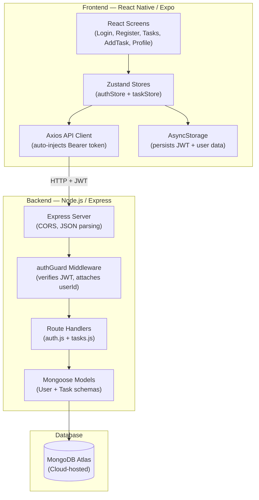
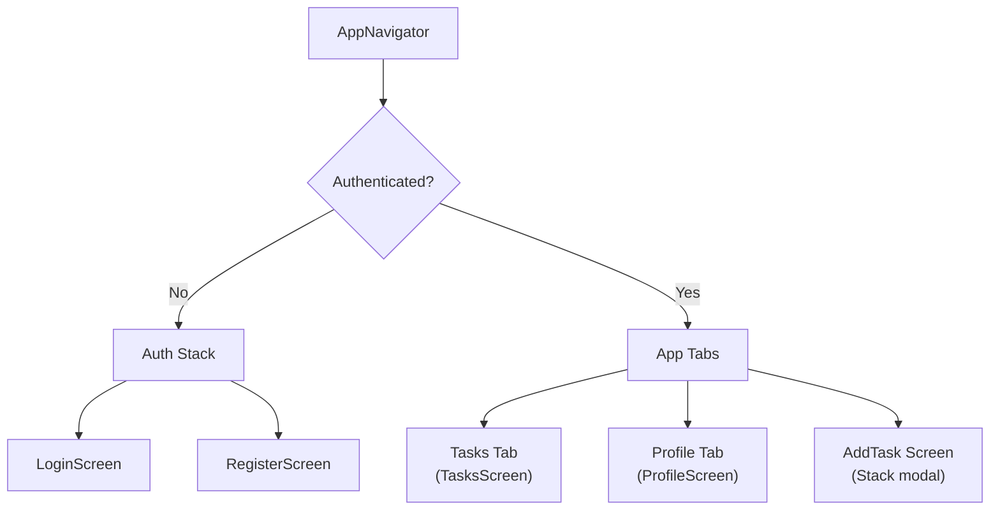

# 📋 TaskFlow

<<<<<<< HEAD
**A mobile-first task management application with secure per-user authentication, built end-to-end on the MERN stack.**
=======
TaskFlow is a mobile task management application built using the full stack (React Native + Expo SDK 54, Node.js + Express, MongoDB + Mongoose), state management using Zustand, and per-user JWT authentication.
>>>>>>> 42d9558fb5f0479b3ab4c6d3ebd116489711083f

---

## 📖 About

TaskFlow is a personal productivity app that lets each user register an account, log in securely, and manage their own private collection of tasks — all from a polished, dark-themed mobile interface. Users can create tasks with titles, notes, priority levels, and optional due dates, then filter between active and completed items with a single tap.

The project was built as a full-stack portfolio piece to demonstrate mastery of the complete MERN workflow: from designing a RESTful API with ownership-protected routes, to wiring a React Native frontend with global state management and persistent authentication.

---

## 🎯 The Need

Most "to-do list" tutorials stop at local state and never touch real authentication, server-side data persistence, or the security patterns required in production apps. TaskFlow goes further by implementing the full chain:

- **User isolation** — every task is tied to the authenticated user's database ID, enforced server-side. Users can never see or modify each other's data, regardless of what the client sends.
- **Token-based auth** — passwords are never stored in plaintext. They're hashed before touching the database, and all subsequent requests are authorized via cryptographically signed tokens.
- **Persistent sessions** — closing the app doesn't log you out. The auth token is persisted to device storage and rehydrated automatically on the next launch.
- **Optimistic UI updates** — when you toggle a task's status or delete it, the UI updates instantly without waiting for the server round-trip. If the server rejects the change, the UI rolls back to its previous state.

These are patterns you'll encounter in every production mobile app, and TaskFlow implements each one cleanly in a single, auditable codebase.

---

## 🔐 Demystifying the Security Model

TaskFlow uses several security concepts that are worth understanding before diving into the code. This section explains each one in plain language.

### What is JWT (JSON Web Token)?

A JWT is a compact, URL-safe string that the server creates after a successful login. Think of it as a "digital ID badge" — the server signs it with a secret key, and the client sends it back with every request to prove who they are. The server can verify the badge is genuine without needing to look anything up in a database.

**How TaskFlow uses it:** When you log in, the backend creates a JWT containing your user ID and an expiration date (7 days). The mobile app stores this token on the device and attaches it to every API request as a `Bearer` header. The backend's `authGuard` middleware verifies the token on every protected route before the request reaches the route handler.

### What is Password Hashing (bcrypt)?

Storing passwords as plain text is a critical security vulnerability — if the database is ever compromised, every user's password is exposed. **Hashing** transforms the password into an irreversible string of characters using a one-way mathematical function. Even the server operator cannot reverse it.

**How TaskFlow uses it:** During registration, the password is hashed using `bcryptjs` with a salt factor of 10 (meaning the algorithm deliberately runs slowly to resist brute-force attacks). During login, the entered password is hashed again and compared against the stored hash — the raw password is never stored or transmitted after the initial request.

### What is Token Hydration?

"Hydration" refers to restoring application state from persistent storage when the app starts. Without it, users would be forced to log in every time they open the app.

**How TaskFlow uses it:** On app launch, the `authStore` reads the JWT and user data from `AsyncStorage` (React Native's local key-value storage). If a valid token exists, the app skips the login screen entirely and renders the task list. If not, the user is redirected to the login screen.

### What are Optimistic Updates?

An **optimistic update** is a UI pattern where the interface reflects a change *immediately*, before the server confirms it. This makes the app feel instant, even on slow networks.

**How TaskFlow uses it:** When you mark a task as done or delete it, the `taskStore` updates the local task list right away and simultaneously sends the request to the server. If the server returns an error, the store rolls back to the previous state — the user sees the change revert and an error message appear.

---

## 🏗️ Architecture & Tech Stack

### Stack by Layer

| Layer | Technology | Version | Why This Choice |
|---|---|---|---|
| **Mobile Frontend** | React Native (Expo, managed workflow) | SDK 54 | Cross-platform mobile development without native build configuration |
| **State Management** | Zustand | 4.x | Zero-boilerplate global state with trivial store reset on logout |
| **Navigation** | React Navigation (Stack + Bottom Tabs) | 7.x | Industry-standard navigation library for React Native |
| **HTTP Client** | Axios (centralized instance) | 1.x | Single point of control for auth header injection and error interception |
| **Token Storage** | AsyncStorage | 2.x | Only mobile-safe persistent key-value store in Expo managed workflow |
| **Icons** | Feather (via `@expo/vector-icons`) | 15.x | Clean, consistent icon set bundled with Expo |
| **Backend Runtime** | Node.js + Express | 18.x / 4.x | Lightweight REST API framework with mature middleware ecosystem |
| **Database** | MongoDB Atlas (via Mongoose ODM) | 8.x | Document-based storage ideal for flexible task schemas |
| **Password Security** | bcryptjs | 2.x | Industry-standard one-way password hashing with configurable salt rounds |
| **Auth Tokens** | jsonwebtoken | 9.x | Stateless authentication — no server-side session storage required |

### System Architecture



### Navigation Architecture



The navigator conditionally renders either the **Auth Stack** (login/register) or the **App Tabs** (tasks/profile) based on the `isAuthenticated` flag in `authStore`. There is no manual navigation call on login success — the state change alone triggers the screen swap.

---

## 🔄 Data Flow

This section traces a complete user interaction from UI tap to database and back.

### Example: Creating a New Task

```
1. User fills out the AddTaskScreen form and taps "Create Task"
2. Screen calls taskStore.addTask(title, note, priority, dueDate)
3. taskStore sends POST /api/tasks via the Axios client
4. Axios request interceptor reads the token from authStore and injects the Bearer header
5. Express receives the request → authGuard middleware verifies the JWT
6. authGuard extracts userId from the token payload and attaches it to req.userId
7. tasks.js route handler creates a new Task document with req.userId as the owner
8. Mongoose validates the schema (priority ∈ {low, medium, high}, status defaults to 'active')
9. MongoDB Atlas persists the document and returns it
10. Backend responds with { data: savedTask, error: null }
11. taskStore prepends the new task to the local tasks array
12. TasksScreen re-renders — the new task appears at the top of the list
```

### Example: App Launch (Token Hydration)

```
1. App.js renders AppNavigator
2. AppNavigator calls authStore.hydrate() on mount
3. hydrate() reads 'userToken' and 'userData' from AsyncStorage
4. If both exist → sets isAuthenticated = true → App Tabs render
5. If missing → isAuthenticated remains false → Auth Stack renders (Login screen)
```

---

## 📡 API Reference

All endpoints follow a consistent response envelope:

```json
{ "data": <payload>, "error": null }        // Success
{ "data": null, "error": "Error message" }   // Failure
```

### Authentication Routes (Public)

| Method | Endpoint | Body | Success Code | Description |
|---|---|---|---|---|
| `POST` | `/api/auth/register` | `{ name, email, password }` | `201` | Creates a new user, returns JWT + user object |
| `POST` | `/api/auth/login` | `{ email, password }` | `200` | Validates credentials, returns JWT + user object |

### Task Routes (Protected — requires `Authorization: Bearer <token>`)

| Method | Endpoint | Body | Success Code | Description |
|---|---|---|---|---|
| `GET` | `/api/tasks` | — | `200` | Returns all tasks for the authenticated user |
| `POST` | `/api/tasks` | `{ title, note?, priority?, dueDate? }` | `201` | Creates a new task owned by the authenticated user |
| `PUT` | `/api/tasks/:id` | `{ title?, note?, priority?, dueDate?, status? }` | `200` | Updates a task (ownership verified server-side) |
| `DELETE` | `/api/tasks/:id` | — | `200` | Permanently deletes a task (ownership verified) |

### Utility

| Method | Endpoint | Success Code | Description |
|---|---|---|---|
| `GET` | `/health` | `200` | Returns `{ status: 'ok', timestamp }` for uptime checks |

---

## 🗂️ Project Structure

```
taskflow/
├── App.js                          ← Entry point — renders AppNavigator
├── app.json                        ← Expo configuration (dark theme, assets)
├── package.json                    ← Frontend dependencies
├── babel.config.js                 ← Babel preset for Expo
├── .env                            ← EXPO_PUBLIC_API_URL (gitignored)
│
├── backend/                        ← Express REST API
│   ├── server.js                   ← App entry — CORS, JSON parsing, route mounting, DB connection
│   ├── .env                        ← MONGO_URI, JWT_SECRET, PORT (gitignored)
│   ├── .env.example                ← Committed placeholder for environment variables
│   ├── package.json                ← Backend dependencies
│   ├── models/
│   │   ├── User.js                 ← Schema: name, email, passwordHash, timestamps
│   │   └── Task.js                 ← Schema: title, note, priority, dueDate, status, userId
│   ├── routes/
│   │   ├── auth.js                 ← POST /register, POST /login (public)
│   │   └── tasks.js                ← Full CRUD (protected by authGuard)
│   ├── middleware/
│   │   └── authGuard.js            ← Verifies JWT, attaches req.userId
│   └── utils/
│       └── generateToken.js        ← jwt.sign() wrapper (7-day expiry)
│
├── src/                            ← React Native mobile app
│   ├── api/
│   │   └── client.js               ← Axios instance with token interceptor
│   ├── store/
│   │   ├── authStore.js            ← Auth state: login, register, logout, hydrate
│   │   └── taskStore.js            ← Task state: CRUD operations with optimistic updates
│   ├── hooks/
│   │   └── useProtectedRoute.js    ← Auth verification hook
│   ├── navigation/
│   │   └── AppNavigator.js         ← Conditional auth/app stack rendering
│   ├── screens/
│   │   ├── LoginScreen.js          ← Email/password login with validation
│   │   ├── RegisterScreen.js       ← Name/email/password registration
│   │   ├── TasksScreen.js          ← Task list with filter bar + FAB
│   │   ├── AddTaskScreen.js        ← Task creation form with priority & date presets
│   │   └── ProfileScreen.js        ← User info display + logout action
│   └── components/
│       ├── TaskCard.js             ← Task display with status toggle + delete
│       ├── FilterBar.js            ← All / Active / Done tab pills
│       └── PriorityBadge.js        ← Color-coded priority indicator (green/amber/red)
│
├── docs/                           ← Project documentation
│   ├── CHANGELOG.md                ← File-level change log
│   ├── DECISIONS.md                ← Architecture decision records
│   ├── ERROR_LOG.md                ← Bug tracking and resolutions
│   ├── HIGH_LEVEL_DESIGN.md        ← System architecture overview
│   └── PRD.md                      ← Product requirements document
│
└── tests/                          ← Test artifacts
    └── runs/
        └── 2026-05-23_backend-integration/
```

---

## 🚀 Installation & Setup

### Prerequisites

| Requirement | Minimum Version | Purpose |
|---|---|---|
| **Node.js** | 18.x | JavaScript runtime for both backend and Expo CLI |
| **npm** | 9.x | Package management (ships with Node.js) |
| **Expo Go** (mobile app) | Latest | Run the React Native app on a physical device |
| **MongoDB Atlas** account | Free tier | Cloud-hosted database — no local MongoDB installation needed |

### Step 1 — Clone the Repository

```bash
git clone <repository-url>
cd taskflow
```

### Step 2 — Backend Setup

```bash
cd backend
npm install
```

Create a `.env` file from the provided template:

```bash
cp .env.example .env
```

Fill in the environment variables:

```env
PORT=5000
MONGO_URI=mongodb+srv://<username>:<password>@<cluster>.mongodb.net/taskflow
JWT_SECRET=replace_with_a_long_random_string_minimum_32_characters
```

> [!IMPORTANT]
> The `MONGO_URI` must point to a valid MongoDB Atlas cluster. Create a free cluster at [mongodb.com/atlas](https://www.mongodb.com/atlas) if you don't have one. Ensure your IP address is whitelisted in the Atlas Network Access settings.

Start the backend server:

```bash
npm start
```

You should see:

```
MongoDB connected successfully.
Server running on port 5000
```

### Step 3 — Frontend Setup

Open a **new terminal** at the project root (not inside `backend/`):

```bash
npm install
```

Create a `.env` file at the project root:

```env
EXPO_PUBLIC_API_URL=http://<YOUR_LOCAL_IP>:5000
```

> [!WARNING]
> Do **not** use `localhost` or `127.0.0.1` here. When running on a physical device via Expo Go, the device cannot reach `localhost` on your computer. Use your machine's local network IP instead (e.g., `192.168.1.100`). Find it with `ipconfig` (Windows) or `ifconfig` (macOS/Linux).

Start the Expo development server:

```bash
npx expo start
```

Scan the QR code with Expo Go on your phone (or press `a` for Android emulator / `i` for iOS simulator).

---

## ✨ Feature Summary

| Feature | Details |
|---|---|
| 🔒 **User Registration** | Name, email, and password. Email uniqueness enforced. Password hashed with bcrypt (salt ≥ 10). |
| 🔑 **User Login** | JWT-based authentication. Token stored in AsyncStorage, valid for 7 days. |
| 🛡️ **Protected Routes** | All task endpoints guarded by `authGuard` middleware. Unauthorized requests receive `401`. |
| ➕ **Create Tasks** | Title (required), note (optional), priority selector, due date via presets or custom input. |
| 📋 **Task List** | FlatList with pull-to-refresh. Filter between All / Active / Done via FilterBar. |
| ✅ **Toggle Status** | Tap the circle icon to mark a task as done (or undo it). Uses optimistic updates with rollback. |
| 🗑️ **Delete Tasks** | Permanent deletion with optimistic UI removal. Rolls back if the server rejects the request. |
| 🏷️ **Priority Badges** | Color-coded pills — 🟢 Low, 🟡 Medium, 🔴 High — rendered on every task card. |
| 🚪 **Logout** | Clears AsyncStorage, resets both Zustand stores, and redirects to the login screen. |
| 💾 **Session Persistence** | Token hydration on app launch — previously authenticated users skip the login screen. |

---

## 📊 Database Schemas

### User Collection

| Field | Type | Constraints | Description |
|---|---|---|---|
| `name` | String | Required, trimmed | User's display name |
| `email` | String | Required, unique, lowercase, trimmed | Login identifier |
| `passwordHash` | String | Required | bcrypt-hashed password (never stored as plaintext) |
| `createdAt` | Date | Auto-generated | Mongoose timestamp |
| `updatedAt` | Date | Auto-generated | Mongoose timestamp |

### Task Collection

| Field | Type | Constraints | Description |
|---|---|---|---|
| `title` | String | Required, trimmed | What needs to be done |
| `note` | String | Optional, trimmed | Additional details or context |
| `priority` | String | Required, enum: `low` · `medium` · `high`, default: `low` | Urgency level |
| `dueDate` | Date | Optional | Deadline for the task |
| `status` | String | Required, enum: `active` · `done`, default: `active` | Completion state |
| `userId` | ObjectId | Required, references `User` | Owner — enforced by `authGuard` |
| `createdAt` | Date | Auto-generated | Mongoose timestamp |
| `updatedAt` | Date | Auto-generated | Mongoose timestamp |

---

## ⚙️ Key Architecture Decisions

| Decision | Choice | Rationale |
|---|---|---|
| State library | **Zustand** over Redux / Context API | Zero boilerplate, trivial store reset on logout, excellent React Native performance |
| Auth strategy | **Access token only** (7-day expiry) | Refresh token rotation adds complexity unnecessary for a portfolio-scope app |
| Token storage | **AsyncStorage** | Only persistent storage option in Expo managed workflow |
| HTTP client | **Single Axios instance** in `client.js` | Centralizes auth header injection — no scattered `fetch()` calls |
| Circular dependency avoidance | **Token getter callback** pattern | `authStore` imports `client`, so `client` cannot import `authStore`. Instead, `client` accepts a `setTokenGetter` function called once after module load |
| Styling | **`StyleSheet.create()` only** | Native performance, no third-party styling dependencies, consistent with React Native conventions |
| Task deletion | **Hard delete** (no soft delete) | Archive/restore functionality is out of scope — simpler schema |

---

## 📄 License

This project is a portfolio demonstration and is not currently licensed for redistribution.
